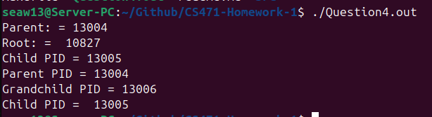

## Contents of the folder

* We have one directory [src](src) which contains all the code for Questions 2-4.

## Running the programs in source

* A linux system that can run make files will be needed

Calling "make all" will compile the code into 3 seprate file, one for each question, labled as QuestionX.out where x is the question number.
* Question 2 can be run with the command "./Question2.out n" where n is the number of natural numbers you would like it to find the sum of.
* Question 3 and 4 can be run with the command "./QuestionX.out" X being the question number 

## Question 1
After experimenting with the fork command, a pattern can be notice, when the fork command is called 2 processes then exist, the process that called the command and a child process with the same code starting from where it was created. This leads to there being 2^n processes created by the end of the process where n is the number of fork calls, assuming no conditional statements used to control the fork calls. 

In the code shown in question one there is 10 fork calls and no conditionals limiting the fork calls, meaning there are 2^10 processes or 1024 processes.

## Question 4
After running the program provided in Question 4, the following was printed to the console.

The program creates a child process and, after verifying the process was made, int that child process prints the process id of it and it's parent before creating a child itself and, after once again verify the process was made, and in that new child process prints it's and the previous child's process id. Back in the parent process, the process id of it and it's root is printed before waiting for all children processes to end.
